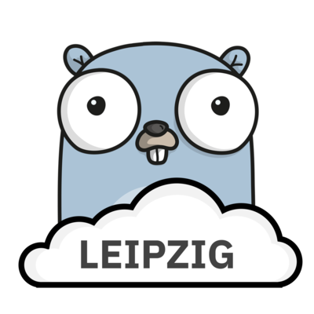
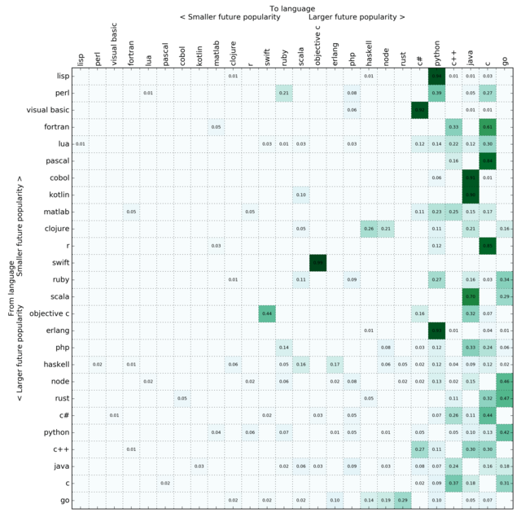
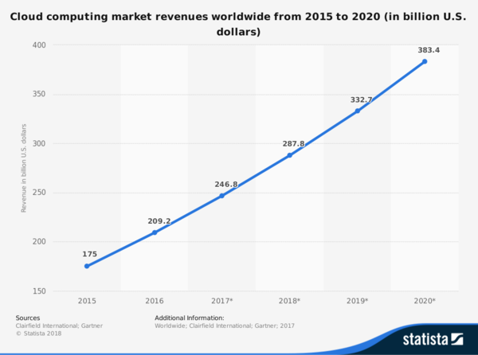

# Welcome

Welcome to Go and Cloud Native Leipzig #1.

2019-02-08, 19:00 CET, Basislager Leipzig

> [@golang_leipzig](https://twitter.com/golang_leipzig), [golangleipzig.space](https://golangleipzig.space)

----

# Why

* idea floated around for some time
* there were some previous meetups and events around Go, e.g. [Ready to Go](https://www.meetup.com/de-DE/Softwerkskammer-Leipzig/events/245523279/) (04/2018), [devopenspace 2018](https://devopenspace.de/) (10/2018) and more

----

# Idea

Join forces, combine Go and Cloud, just start and see where this goes.

----

# Go

* [The eigenvector of "Why we moved from language X to language Y"](https://erikbern.com/2017/03/15/the-eigenvector-of-why-we-moved-from-language-x-to-language-y.html) (2017)

> I took the stochastic matrix sorted by the future popularity of the language (as predicted by the first eigenvector).

----

# Go

----

# Go

> Surprisingly, (to me, at least) Go is the big winner here. There is a ton of search results for people moving from X to Go. I'm not even sure how I feel about it (I have mixed feelings about Go) but I guess my infallible analysis points to the inevitable conclusion that Go is something worth watching.

----

# Cloud

The market.

From [https://www.statista.com/statistics/270811/cloud-computing-revenue-worldwide-since-2008/](https://www.statista.com/statistics/270811/cloud-computing-revenue-worldwide-since-2008/).

----

# Today

* past, present and future use of Go and Cloud
* ideas for presentations, workshops
* beer!

